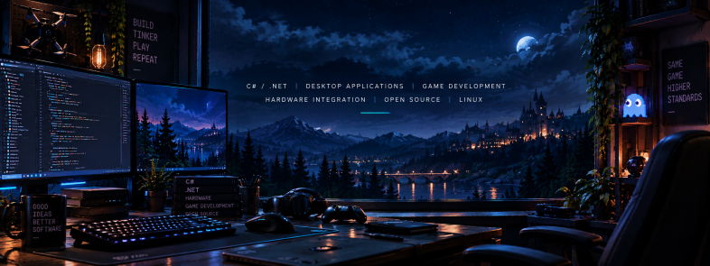

Morpheus: Let me tell you why you’re here. You’re here because you know something. What you know you can’t explain. But you feel it. You’ve felt it your entire life. That there’s something wrong with the world. You don’t know what it is but it’s there, like a splinter in your mind driving you mad. It is this feeling that has brought you to me. Do you know what I’m talking about?

Neo: The Matrix?

Morpheus: Do you want to know what it is? The Matrix is everywhere. It is all around us, even now in this very room. You can see it when you look out your window or when you turn on your television. You can feel it when you go to work, when you go to church, when you pay your taxes. It is the world that has been pulled over your eyes to blind you from the truth.

Neo: What truth?

Morpheus: That you are a slave, Neo.
   

      
   

---

## 🧰 Technologies & Tools

 

## My Journey

It started in the mid-'90s, sitting in front of an Amiga 1200 and wondering what this machine could really do.

I was around seven years old when I first became fascinated by the idea of making a computer display the things I imagined, turning thoughts into something real on a screen.

More than simply using computers, I wanted to understand them: why something worked, how it worked, and what would happen if I pushed it a little further.

Years later, I learned that there was a word for that kind of curiosity: **hacking**. I never really thought of myself as a hacker, but the mindset, exploring, understanding, modifying and building, has stayed with me ever since.

Games, computers and movies such as **Terminator 2**, along with series like **MacGyver**, only reinforced that fascination with software, electronics, machines and creative problem-solving.

The idea that you could understand how something worked, improvise with the tools available, and build or fix things yourself had a lasting influence on me.

That curiosity eventually became a profession, but the motivation is still largely the same:

**Build things. Understand how they work. Make them do something they weren't doing before.**

## 🔧 What I build

- Desktop applications and libraries with C# / .NET
- Database-backed applications and data access layers
- REST APIs and background services
- Hardware and controller integrations
- Open-source NuGet packages
- Game-development and embedded projects

## Commit Snake

<picture>
  <source
    media="(prefers-color-scheme: dark)"
    srcset="https://raw.githubusercontent.com/spreedated/spreedated/output/github-contribution-grid-snake-dark.svg"
  />
  <source
    media="(prefers-color-scheme: light)"
    srcset="https://raw.githubusercontent.com/spreedated/spreedated/output/github-contribution-grid-snake.svg"
  />
  
</picture>